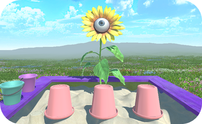
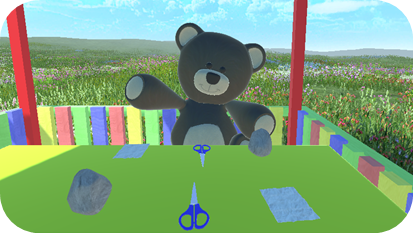
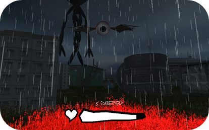
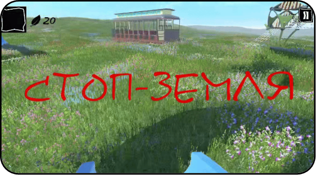
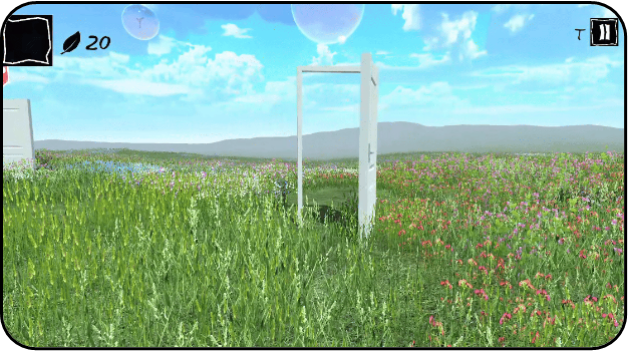
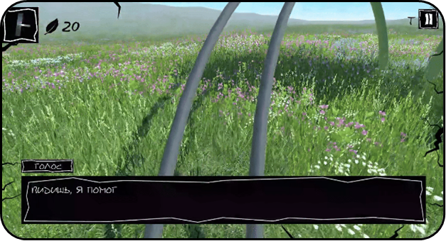
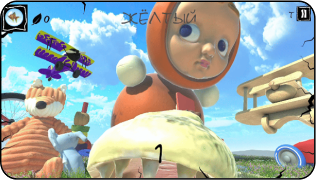
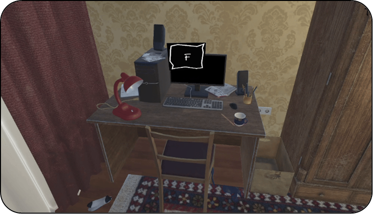
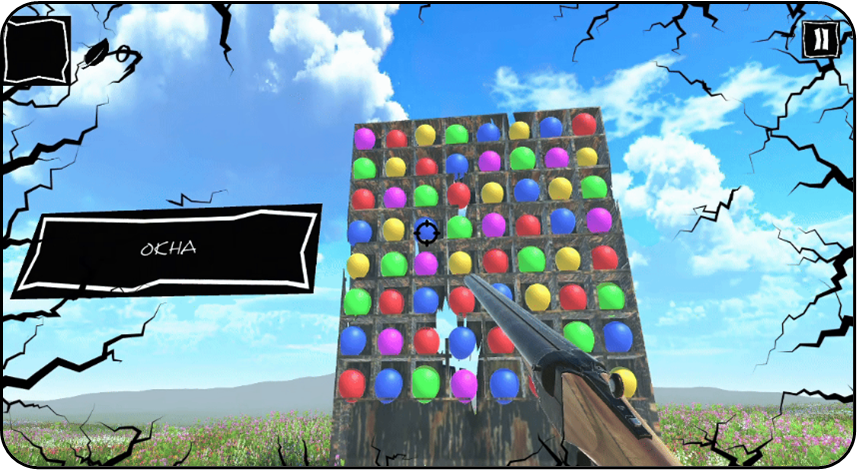

# «Эфир»

Приключенческая игра-квест для ПК, разработанная на Unity в рамках гранта «Студенческий стартап».

Проект успешно завершён, протестирован и сдан в Фонд содействия инновациям.

## О проекте

Игра о путешествии в неизведанном мире. Главному герою предстоит пройти через множество испытаний, чтобы вернуться в свою реальность. Испытания представляют собой мини-игры
с уникальными механиками, выполненными в формате известных детских игр.

## Моя роль

проектирование игровых механик;

разработка системы взаимодействия игрока с объектами и окружением;

реализация инвентаря;

разработка диалоговой системы;

создание ключевых игровых механик в формате мини-игр;

реализация основной логики игры и системы концовок;

разработка пользовательского интерфейса;

тестирование и исправление ошибок.

## Технологии

Unity

C#

Visual Studio

Git

UI System

## Видео игрового процесса

[Ссылка на видео](https://drive.google.com/file/d/1uOqslBB0ToxYcOuHR4R2Mtr8Rmx0tH01/view?usp=sharing)

## Билд

[Скачать последнюю версию](https://github.com/darsidaff/Ether/releases/tag/V1)

## Скриншоты

 
 
 
 

